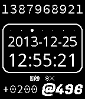

pebble-beapoch
==============

Pebble watch face that displays Unix time and Swatch .beats.

Build status: 

Link to latest successfully built app bundle as soon as the spectacularly
awesome [CloudPebble](http://cloudpebble.net) supports it.

Appstore: 

(An older version that uses the v1 SDK can be found in the `pebble-sdk-v1`
branch in the git repository.)

License
-------

The code uses the MIT license. See the LICENSE file for details.

Three third-party fonts (Droid Sans, Fugaz One and Source Code Pro) are also
distributed with this project, each with their own license. See the individual
directories in `resources/fonts/` for details.

The images in `resources/images` are based in some icons I
[found on the Pebble forums](http://forums.getpebble.com/discussion/5266/set-of-icons-for-app-s-and-future-development)
which appear to be in the public domain based on comments by the creator.

Making it work
--------------

You'll need to set up a dev environment as described in the
[Pebble SDK 2.0 docs](http://developer.getpebble.com/2/). Use the
[pebble tool](https://developer.getpebble.com/2/getting-started/pebble-tool/)
to build and install.

Bugs and issues
---------------

There are no known bugs, because I haven't figured out how to write unit tests
for Pebble projects.

Things that could maybe be done better:

 * The battery status indicator has a slightly different set of states from the
   built-in indicator. (The battery state service seems to deliver a slightly
   different set of data from what the built-in stuff uses.)

 * The first one or two queries to the phone for the timezone offset usually
   fail because the JS app hasn't started up yet. Since the JS app sends us an
   unsolicited timezone offset when it starts up, we can probably afford to
   wait a few seconds before asking for one.

 * The conversion from a `struct tm` to a `time_t` for the unix timestamp
   calculation is clunky and will be incorrect from 2100 when the naive leap
   year calculation breaks down. Hopefully a future version of the firmware
   will support timezones natively (or at least have a working `mktime()`).
